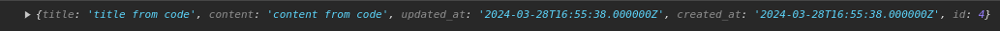

<!-- slide 1 -->
# Библиотека Axios
### Кормышев Егор ИСиП-301
---
<!-- slide 2: axios installation -->
# Установка

Для установки axios в проект используется команда `npm i axios`

---

<!-- slide 3: types of HTTP requests -->
# Виды HTTP запросов

* **GET** - получение данных
* **POST** - добавление данных
* **PUT/PATCH** - обновление/изменение данных
* **DELETE** - удаление данных

---

<!-- slide 4: get request syntax -->
# Синтакис GET запроса

```js
import axios from "axios" // импорт

axios.get('http://127.0.0.1:8000/api/posts/all').then(res => {
	console.log(res.data) // поле "data" возвращает значение уже в json 
)
	.catch(err => {
		console.log(err)
	})

```
---

### Результат


---

<!-- slide 4: post request syntax -->
# Синтакис POST запроса

```js
import axios from "axios" // импорт

axios.post('http://127.0.0.1:8000/api/posts/new', { // данные для изменения/удаления в формате js-объекта (НЕ JSON)
	title: 'title from code',
	content: 'content from code'
}
).then(res => {
	console.log(res.data)
})
	.catch(err => {
		console.log(err)
	})

```

---

### Результат


### getAll


---


<!-- slide 5: put request syntax -->
# Синтакис PUT запроса

```js
import axios from "axios" // импорт

axios.put('http://127.0.0.1:8000/api/posts/update/1', { // данные для изменения/удаления в формате js-объекта (НЕ JSON)
	title: 'updated title from code',
	content: 'updated content from code',
	likes: 3
}
).then(res => {
	console.log(res.data)
})
	.catch(err => {
		console.log(err)
	})

```

---

### Результат


### getAll


---


<!-- slide 5: delete request syntax -->
# Синтакис DELETE запроса

```js
import axios from "axios" // импорт

axios.delete('http://127.0.0.1:8000/api/posts/delete/1')
	 .then(res => {
	console.log(res.data)
})
	.catch(err => {
		console.log(err)
	})

```

---

### Результат


### getAll


