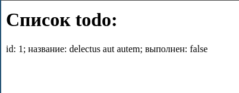

<!-- slide 1 -->

# Вывод данных JSON
### Кормышев Егор ИСиП-301
---
<!-- slide 2: what is JSON -->
# Что такое JSON?
Для начала давайте вспомним, что такое *JSON*

**JSON** (_JavaScript Object Notation_) - Один из основных форматов изпользуемых при передаче данных

Формат JSON содержит всего 3 структуры:

* Строка (она же *ключ-значение*)
* Объект
* Массив

Поговорим о них подробнее

---

<!-- slide 3: json string -->

# JSON Строка

Строка в JSON имеет выглядит примерно так: `"name":"value",`

и имеет следующую структуру:

* `name` - название - любая строка (<span style="color:red;">ОБЯЗАТЕЛЬНО В КАВЫЧКАХ</span>)

* `:` - (двоеточие) - разделитель ключа и значения 

* `value` - значение - значение в зависимости от типа (в данном случае строка)

* `,` - (запятая) - разделитель строк (<span style="color:red;">ПОСЛЕ ПОСЛЕДНЕЙ СТРОКИ НЕ СТАВИТСЯ</span>)

---

<!-- slide 4: datatypes in JSON  -->

# Типы данных значения

* `string` - строка - любая строка (например: `"example"`)
* `number` - число - любое число (целое или дробное) без кавычек (например: `"myNum":123` или `"myNum":123.45`)
* `boolean` - логический - логическое значение (`true` или `false`) без кавычек (например: `"myBool":true` или `"myBool":false`)
* `null` - пустое значение (`null`) без кавычек (например: `"myNullValue":null`)

А также объект и массив, о которых мы поговорим далее

---

<!-- slide 5: JSON object -->

# Объекты в JSON {#Объекты_в_JSON}

Объект - группа других данных любого типа

<b style="color:red;">ПРИМЕЧАНИЕ:</b> Любой json файл содержит хотя-бы 1 (главный) объект

Например:

```json
{ <- начало главного объекта
  "name": "assets",
  "version": "1.0.0",
  "main": "index.js",
} <- конец главного объекта
```

---

<!-- slide 6: inner objects in json  -->

Также объекты могут быть вложенными, как значения других полей (ключей)

Например:

```json
{
	"main": "index.js",
	"scripts": {
	  "test": "test script"
	}
}
```

В этом примере значением ключа `"scripts"` является **объект**: `{ "test": "test script" }`

---

# Массивы в JSON

Массив - группа **[объектов](#Объекты_в_JSON)**, также могут быть главными и вложенными

Значения в массиве могут быть разных типов

Вложенный массив с разными типами:

```json
{
  "something": "some value",
  "someArray": [1, true, "hello world"]
}

```
Пример главного массива будет далее

---

<!-- slide 7: Requests  -->

# Получение JSON из запросов

Итак, вспомним, как делать запросы используя `fetch()` 

```js
let url = "https://jsonplaceholder.typicode.com/todos"
fetch(url)
  .then((promise) => {
    return promise
      .json()
      .then((data) => {
        console.log(data);
      })
      .catch((err) => {
        console.log(err);
      });
  })
  .catch((err) => {
    console.log(err);
  });

```

---
<!-- sldie 8: json response -->

## И в ответ мы получим:

```json
[ <-- главный массив
  { <-- объект 1
    "userId": 1,
    "id": 1,
    "title": "delectus aut autem",
    "completed": false
  },
  { <-- объект 2
    "userId": 1,
    "id": 2,
    "title": "quis ut nam facilis et officia qui",
    "completed": false
  },
  { <-- объект 3
    "userId": 1,
    "id": 3,
    "title": "fugiat veniam minus",
    "completed": false
  },
]
```
---
<!-- slide 10: road to html  -->

Это то, что вы выводили в консоль на прошлой лекции

А теперь мы научимся делать это **КРАСИВО**

Первое что нужно вспомнить, это как выводить объект и его поля в js

### Допустим, есть такой код:

```js

let obj = {first: 1, second: "hello world"}; // здесь ключи не имеют кавычек т.к. это обычный js-объект, а не json

console.log(obj) // вывести весь объект

console.log(obj.second) // вывести значение поля second
//             ^
//             |
//             оператор "." (точка) для вывода полей 


```
---
<!-- slide 11: console result -->

### Результат в консоли:


---

<!-- slide 12: same in html -->

Что бы получить то же самое в html, достаточно создать несколько тегов и заменить метод `console.log()` на `innerHTML`

Полный пример далее

---

<!-- slide 13: example  -->

```html
<!-- index.html -->

<!doctype html>
<html lang="en">

<head>
	<meta charset="UTF-8" />
	<title>Document</title>

</head>

<body>
  <h1>Список todo:</h1>
  <!-- блок, куда будем выводить данные -->
  <div class="out"></div>
  <!-- скрЫпт -->
	<script src="main.js"></script>
</body>

</html>
```
---

```js
// main.js

let url = "https://jsonplaceholder.typicode.com/todos"; // ссылка запрос
fetch(url)
  .then((promise) => {
    return promise
      .json()
      .then((data) => {
        let outBlock = document.querySelector(".out"); // получаем блок для вывода
        let todo = data[0]; // пока возьмем только первый объект

        outBlock.innerHTML += `id: ${todo.id}; название: ${todo.title}; выполнен: ${todo.completed}`; // выводим информацию в блок
      }) // ошибки (остаются в консоли)
      .catch((err) => {
        console.log(err);
      });
  })
  .catch((err) => {
    console.log(err);
  });
```
### Результат:



---

# Более сложный пример:

```html

<!-- index.html -->
<!doctype html>
<html lang="en">

<head>
	<meta charset="UTF-8" />
	<title>Document</title>
	<link href="style.css" rel="stylesheet" />
</head>

<body>
	<h1>Список todo:</h1>
	<ol class="todo__list"></ol>
	<script src="main.js"></script>
</body>

</html>

```

---

```js
// main.js
let url = "https://jsonplaceholder.typicode.com/todos"
fetch(url)
	.then((promise) => {
		return promise
			.json()
			.then((data) => {
				let outBlock = document.querySelector('.todo__list')
				for (let i = 0; i < 5; i++) { // цикл для вывода в список

					let todo = data[i]

					outBlock.innerHTML += `<li>id: ${todo.id}; название: ${todo.title}; выполнен: ${todo.completed}</li>`
				}
			})
			.catch((err) => {
				console.log(err);
			});
	})
	.catch((err) => {
		console.log(err);
	});


```
---

### Результат:


---

# Пример с таблицей:

```html
<!-- index.html -->
<!doctype html>
<html lang="en">

<head>
	<meta charset="UTF-8" />
	<title>Document</title>
	<link href="style.css" rel="stylesheet" />

</head>

<body>
	<h1>Список todo:</h1>
	<table id="todos__table">
		<thead>
			<tr>
				<th>ID</th>
				<th>Title</th>
				<th>Completed</th>
			</tr>
		</thead>
		<tbody>
		</tbody>
	</table>

	<script src="main.js"></script>
</body>

</html>

```

---

```js

// main.js

fetch("https://jsonplaceholder.typicode.com/todos")
	.then(response => response.json())
	.then(todos => {

		const tableBody = document.getElementById('todos__table').getElementsByTagName('tbody')[0]; // получаем таблицу и строки в ней
		for (let i = 0; i < 15; i++) {
			let todo = todos[i]
			if (todo.completed) {

				const row = tableBody.insertRow(); // вставляем строку
				row.insertCell(0).textContent = todo.id; // ячейка с id
				row.insertCell(1).textContent = todo.title; // название
				row.insertCell(2).textContent = todo.completed ? 'Да' : 'Нет'; // выполнен ли
			}
		}
	})
	.catch(error => console.error('Error:', error));

```

---

### Результат:


